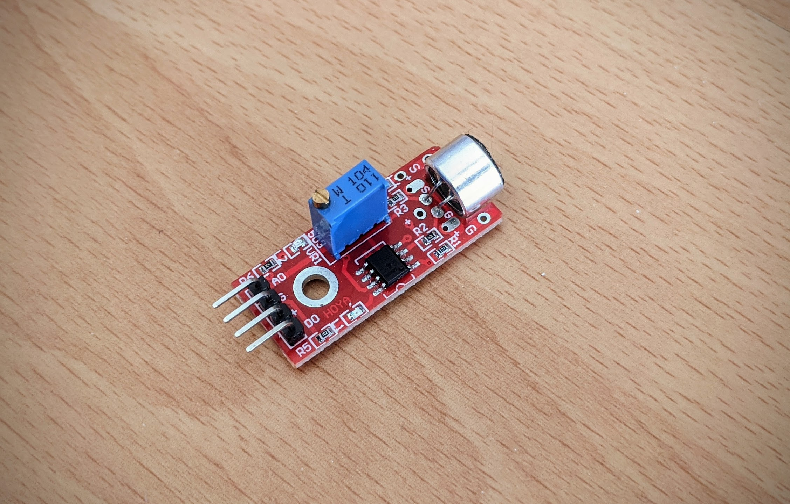
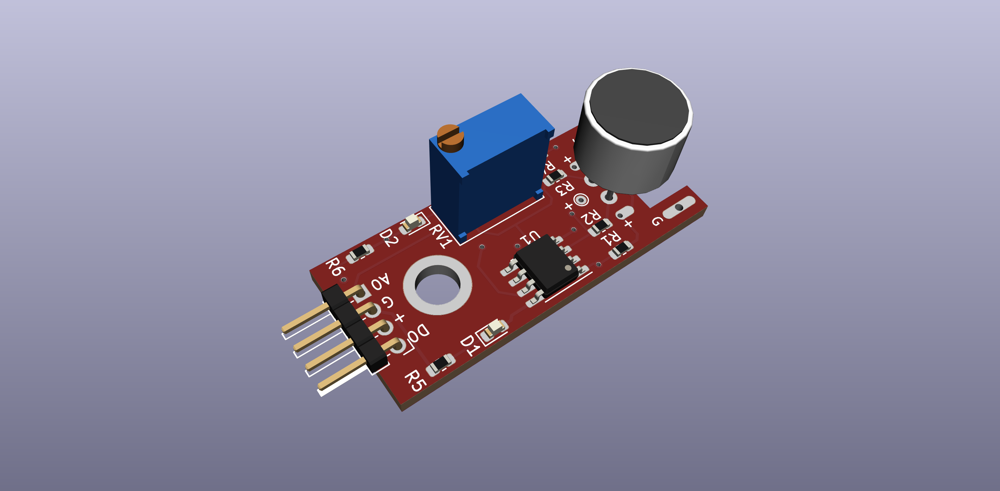
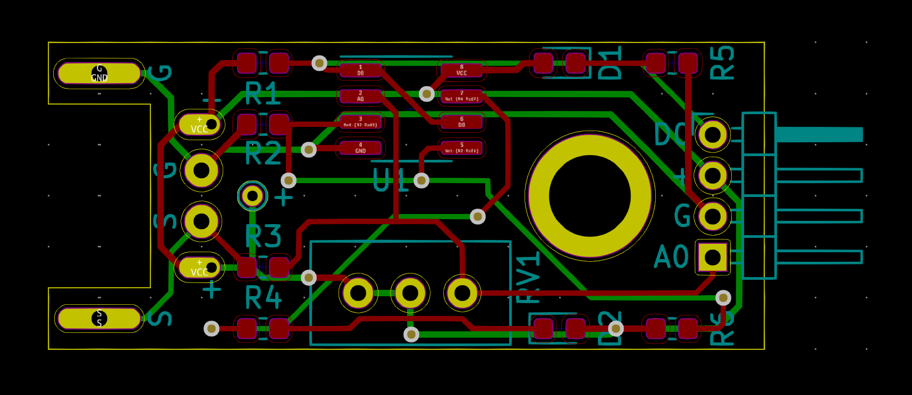
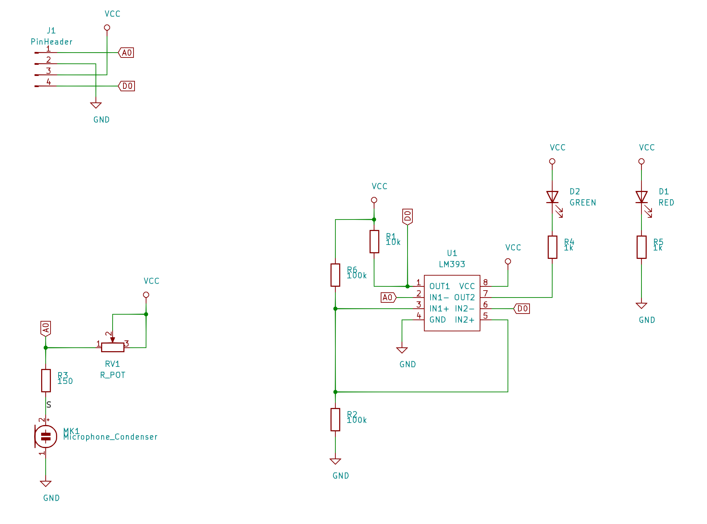

# Microphone module reverse-engineered

I had this microphone sensor module lying around. I wanted to understand how it works
so I reverse engineered its schematic. I also ended up re-creating the PCB and a 3D model.

Everything was done in [KiCad](https://www.kicad-pcb.org).

## Images

